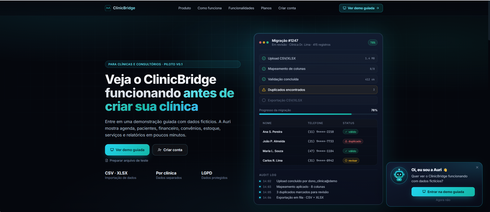
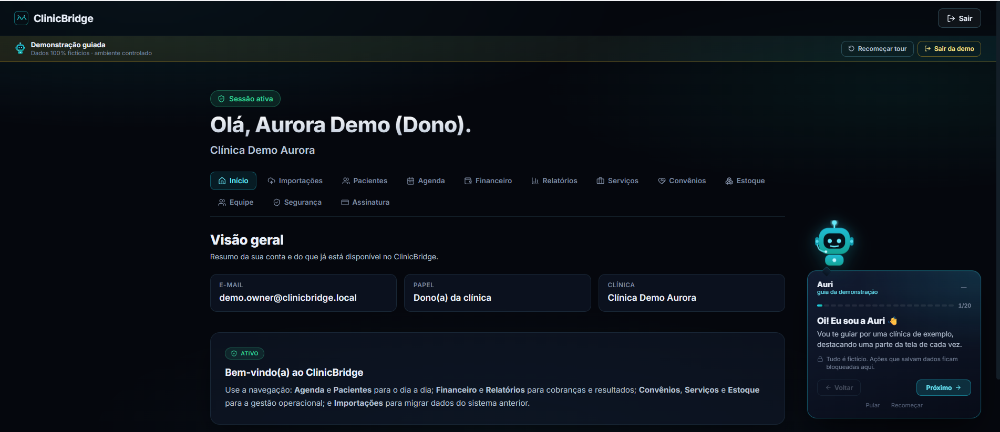
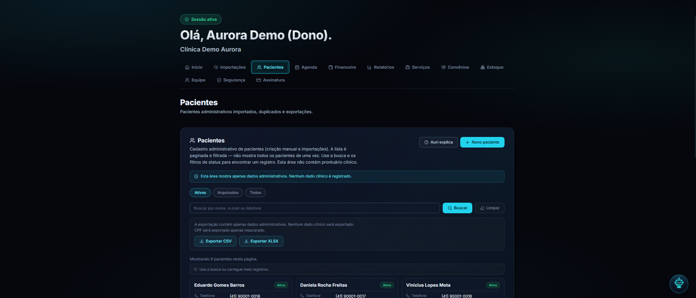
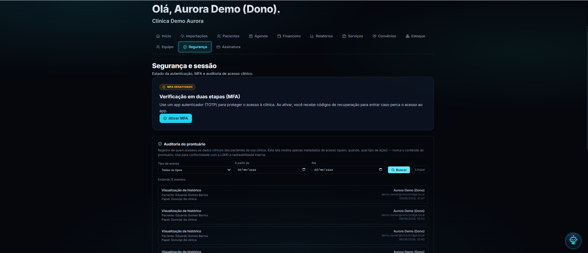
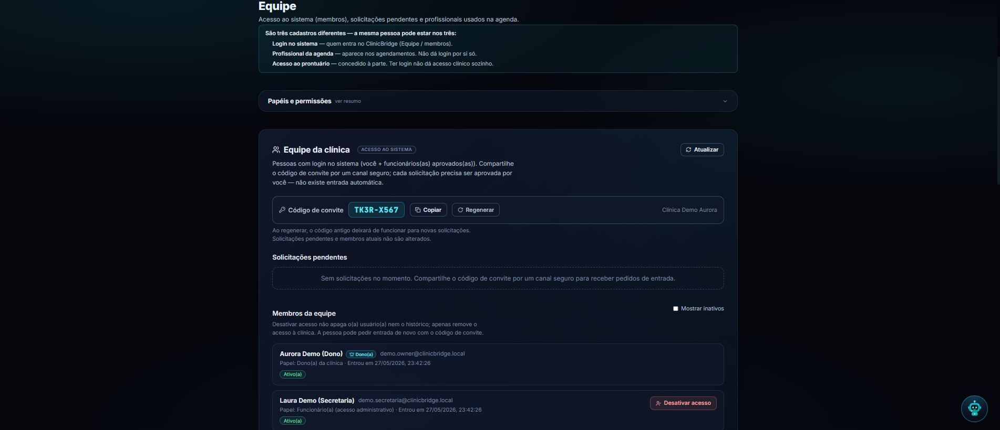
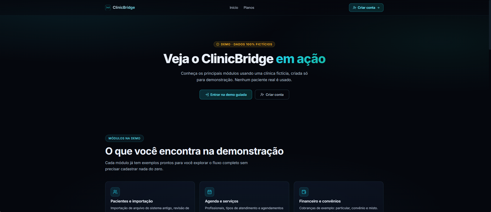
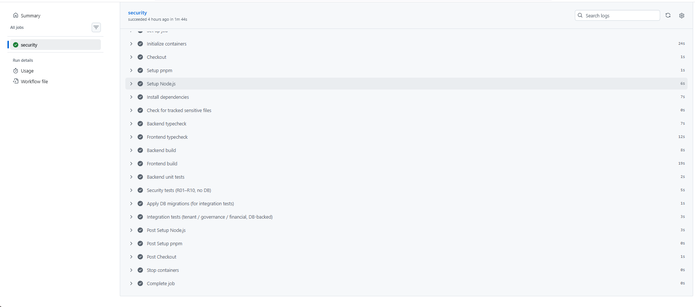
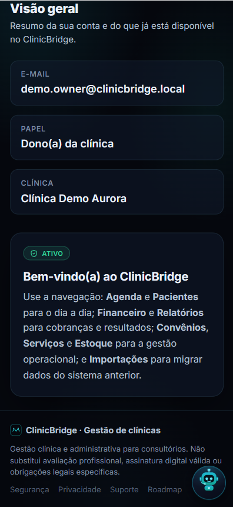

# ClinicBridge

> **Clinic OS modular — gestão administrativa de clínicas com migração inteligente, segurança e privacidade desde o início.**


-orange)

> ⚠️ **MVP local / case acadêmico / protótipo funcional.** Roda em ambiente local com **dados sintéticos**, construído com **boas práticas de segurança e privacidade**. **Não** está em produção, **não** é prontuário eletrônico legal, **não** emite prescrições com força jurídica e **não** afirma conformidade completa com LGPD/HIPAA/CFM/ICP-Brasil. Ver [Status atual](#-status-atual) e [Avisos importantes](#️-avisos-importantes).

---

## 📌 O que é

ClinicBridge é um **Clinic OS modular** para clínicas pequenas: nasceu resolvendo a **migração administrativa segura** (planilhas e sistemas legados → cadastro limpo, auditável e isolado por clínica) e evoluiu para um conjunto de **módulos de gestão** — agenda, financeiro, prontuário administrativo v0.1, serviços, convênios, estoque, relatórios e governança — sempre sob as mesmas invariantes de **multi-tenant, autorização por papel, auditoria e minimização de PII**.

O projeto é usado hoje como **portfólio técnico**, **entrega acadêmica de segurança** e **demonstração local guiada** (com persona "Auri" e dataset 100% fictício). Cada módulo clínico tem ADR própria; o escopo permanece **administrativo**, não substituindo prontuário/sistema clínico real.

## ✨ Destaques de engenharia de segurança

Os pontos que diferenciam o projeto, sem ler as tabelas inteiras:

- 🏢 **Isolamento multi-tenant rígido** — `clinica_id` forçado em **todo DAO**; acesso cross-tenant vira **404 genérico** (`patient_not_found`) para evitar enumeração; DAOs sem `listAll`.
- 🔑 **Auth forte** — senhas **argon2id**, **MFA/TOTP com segredo cifrado em repouso (AES-256-GCM)** + backup codes; sessões JWT; rate limit no login.
- 🛡️ **Privacidade por padrão (LGPD)** — CPF **sempre mascarado**, `member_number`/`holder_name` mascarados; **logs e auditoria são metadata-only** (nunca CPF/nome/telefone/e-mail).
- 🧾 **Auditoria append-only** + **read-audit** específica para dados clínicos; **sem delete físico** em entidades sensíveis (arquivar, não apagar).
- 📥 **Importação/upload segura** — validação por **magic bytes** (não pela extensão), storage privado com nome aleatório + **SHA-256**; export **neutraliza formula injection**; retenção é **dry-run** (não apaga).
- 🚧 **Defesa no backend** — o frontend nunca decide segurança; autorização por papel + grants clínicos + governança (`requireClinicGovernance`).
- 🔒 **Configuração segura** — **guards de boot de produção**, segredos só via env, e um **gate de CI que falha o build** se qualquer arquivo sensível (`.env`/`.pem`/`.csv`/`.xlsx`/dump…) for rastreado pelo git.
- ✅ **64 testes de segurança automatizados** (R01–R10) + integração com Postgres efêmero, rodando no GitHub Actions a cada push/PR.

## 🎯 O problema

Clínicas pequenas costumam ter dados espalhados em planilhas e sistemas antigos, com:

- formatos inconsistentes (CPF, telefone, datas);
- duplicidades de cadastro;
- nenhuma trilha de auditoria;
- migrações manuais arriscadas (perda de dados, vazamento de PII);
- operação fragmentada (agenda numa ferramenta, financeiro noutra, sem isolamento de quem vê o quê).

O ClinicBridge transforma isso num **pipeline guiado e seguro** e numa **base modular** onde cada recurso respeita tenant, papel e privacidade por padrão.

## 🧩 Módulos

| Módulo | O que faz | Destaques de segurança |
|--------|-----------|------------------------|
| **Autenticação / JWT / MFA** | Registro, login JWT, `/auth/me`, MFA TOTP + backup codes | Senha argon2id; segredo TOTP cifrado (AES-256-GCM); login em 2 passos; rate limit |
| **Multi-tenant** | Tudo escopado por `clinica_id` | `requireAuth + requireClinic`; cross-tenant → 403 / 404 genérico; DAOs sem `listAll` |
| **Pacientes / Importação / Exportação** | CSV/XLSX → preview → validação → dry-run → import transacional; CRUD; merge B-safe; export | Magic bytes; CPF mascarado; anti-formula-injection; retenção **dry-run** (não apaga) |
| **Agenda administrativa** | Profissionais, agendamentos, anti-overlap, lembrete manual (sem envio automático) | Sem dado clínico; aviso anti-clínico na UI; tenant + papel |
| **Financeiro v0.1** | Cobranças (pending→paid/canceled), resumo, badge na agenda, alertas | Sem delete físico; `notes` administrativo; audit metadata-only; profissional bloqueado |
| **Prontuário v0.1** | Encontros e notas clínicas (append-only) | Profissional só vê os próprios; `internal_note` redacted; **read-audit LGPD** |
| **Documentos médicos v0.1** | Documentos/receitas, ciclo draft→finalized→canceled, PDF on-demand | Audit STRICT antes de servir; PDF não armazenado; rodapé sem ICP-Brasil |
| **Catálogo de serviços v0.1** | Serviços da clínica + serviços por profissional | Seletor reusado em agenda/financeiro; tenant-scoped |
| **Convênios v0.1** | Operadoras, planos, carteirinhas, preços por serviço | `member_number`/`holder_name` mascarados; audit metadata-only |
| **Estoque v0.1** | Itens e movimentos (entrada/saída/ajuste) | `SELECT FOR UPDATE`; quantidade só muda por movimento; low-stock badge |
| **Relatórios v0.1** | 4 endpoints + painel; filtros por período | 403 por bloco intencional; sem PII excedente |
| **Governança da clínica** | Titular + administradores (ADR 0019) | `requireClinicGovernance`; membro revogado não "ressuscita"; audit por linha |
| **Onboarding / Demo / Auri** | Landing, `/demo`, tour guiado de 8 passos, persona Auri | Demo env-gated; backend `blockDemoWrites`; dataset 100% fictício |
| **Billing / Asaas (sandbox)** | Camada comercial (SaaS cobrando a clínica) — mock + sandbox | Webhook record-only/idempotente; token timing-safe; **cobrança real bloqueada** |
| **Infra / Edge local** | Docker Compose + Nginx reverse proxy com TLS local/staging | Testa fluxo HTTPS, headers, `TRUST_PROXY`, proxy para backend/frontend e cenário com Cloudflare Tunnel sem afirmar produção real |
| **Segurança / Testes / CI** | Suíte de segurança R01–R10 + GitHub Actions | 64 testes; gate de arquivos sensíveis; guards de boot de produção |

> Cada módulo "v0.1" é um recorte deliberadamente conservador, com ADR própria (`docs/adr/0001–0020`). Fora de escopo permanente (sem nova ADR): telemedicina, ICP-Brasil com força legal, TISS/TUSS real, NFS-e, gateway de pagamento real, app mobile nativo, CID estruturado, prescrição eletrônica legal, IA clínica, SNGPC/ANVISA.

## 🔐 Segurança em destaque (R01–R10)

A segurança do ClinicBridge é organizada em **10 requisitos guarda-chuva** para defesa acadêmica e portfólio, agrupando **64 controles catalogados** ([`docs/security-controls-catalog.md`](docs/security-controls-catalog.md)). Cada requisito está ligado a controles no código **e** a testes automatizados ([`docs/security-final-10-requirements.md`](docs/security-final-10-requirements.md)).

| # | Requisito |
|---|-----------|
| **R01** | Autenticação segura e sessões JWT |
| **R02** | Autorização por papéis, grants clínicos e governança |
| **R03** | Isolamento multi-tenant por clínica |
| **R04** | Proteção LGPD de PII e dados clínicos |
| **R05** | Auditoria e rastreabilidade metadata-only |
| **R06** | MFA/TOTP e proteção de segredos de autenticação |
| **R07** | Validação segura de uploads, importações e exports |
| **R08** | Rate limiting e proteção contra abuso |
| **R09** | Configuração segura por ambiente e bloqueios de produção |
| **R10** | Segurança operacional e infraestrutura local/staging |

O requisito **R10** também cobre práticas operacionais e infraestrutura local/staging, incluindo `.gitignore`/`.dockerignore`, Nginx como reverse proxy local, TLS autoassinado para testes, `TRUST_PROXY` explícito e runbooks de produção segura futura.

> Notas detalhadas e ressalvas P1/P2/P3: [`docs/security-notes.md`](docs/security-notes.md).

## 🧪 Testes e CI

O projeto tem **suíte automatizada de segurança** (runner nativo do Node, `tsx --test`) que verifica os 10 requisitos com testes sem banco (unitários + checagens estáticas), além de uma suíte de integração com Postgres.

```bash
# Suíte de segurança (R01–R10) — 64 testes, não precisa de banco
pnpm test:security
# equivalente: pnpm --filter backend test:security

# Cobertura adicional DB-backed (tenant / governança / financeiro)
pnpm --filter backend test:integration
```

**O que a suíte cobre:** 401 em rota protegida sem token (R01); 403 por papel sem permissão (R02); isolamento multi-tenant e tenant-spoofing (R03); mascaramento de PII e anti-formula-injection (R04); redação de logs (R05); cifra do segredo MFA + token timing-safe (R06); upload por magic bytes (R07); configuração de rate limit (R08); guards de boot de produção (R09); ausência de arquivos sensíveis rastreados pelo git (R10).

**GitHub Actions — `security-checks`** ([`.github/workflows/security-checks.yml`](.github/workflows/security-checks.yml)), em cada `push`/`pull_request` para `main`:

- `pnpm install` (frozen lockfile);
- **gate de arquivos sensíveis** (`git ls-files` falha o build se houver `.env`/`.pem`/`.key`/`.crt`/`.sql`/`.dump`/`.csv`/`.xlsx`/`.zip` rastreado);
- **typecheck** de backend e frontend;
- **build** de backend e frontend;
- **64 testes de segurança** (`test:security`);
- **testes de integração** contra um **Postgres efêmero** (serviço do job) com migrations aplicadas.

## 🏗️ Arquitetura

**MVC + DAO com camada de Service**, multi-tenant por `clinica_id`.

```
HTTP → Controller (valida input no edge)
         → Service (regra de negócio: testável sem a camada web)
             → DAO (acesso a banco parametrizado; SEMPRE filtra clinica_id)
                 → PostgreSQL
```

- **Controller:** recebe HTTP, valida no edge, chama Service. Sem SQL, sem regra pesada.
- **Service:** regra de negócio; chama DAOs; auditável.
- **DAO:** queries parametrizadas; **enforce `clinica_id`**; sem delete físico em entidades sensíveis.
- **Frontend:** apresenta/coleta; **não** toma decisões de segurança (a defesa real é o backend).

## 🧱 Stack

- **Backend:** Node.js 20 · Express · TypeScript (strict)
- **Frontend:** React · Vite · TypeScript · TanStack Query
- **Banco:** PostgreSQL 15 (20 migrations)
- **Cache / rate-limit (opcional):** Redis 7
- **Infra local/staging:** Docker Compose · Nginx reverse proxy (`edge`) · TLS local autoassinado · suporte a Cloudflare Tunnel para demonstração controlada
- **Workspace:** pnpm

## 🚀 Como rodar localmente

**Pré-requisitos:** Node.js ≥ 20 (`nvm use` lê o `.nvmrc`), pnpm ≥ 9, Docker + Docker Compose.

```bash
# 1. Variáveis de ambiente
cp .env.example .env
# Gere um JWT_SECRET forte (≥ 48 chars) e cole no .env:
openssl rand -hex 32

# 2. Dependências
pnpm install

# 3. Infra local (PostgreSQL; Redis é opcional)
docker compose up -d postgres
# (opcional) store de rate limit compartilhado:
# docker compose up -d redis

# 4. Migrations
pnpm --filter backend migrate:latest

# 5. Subir os apps
pnpm --filter backend dev     # API → http://localhost:3001
pnpm --filter frontend dev    # Web → http://localhost:5173

# Smoke test
curl http://localhost:3001/health
```

### Demo guiada (opcional, dataset fictício)

```bash
# Popular a "Clínica Demo Aurora" (20 pacientes, agenda, cobranças, convênios, estoque)
ALLOW_DEMO_SEED=true pnpm --filter backend seed:demo:full
# Habilitar login de demonstração (NUNCA em produção)
# .env: ALLOW_DEMO_LOGIN=true   → POST /auth/demo-login (sem credenciais; identidade fixa server-side)
```

> Variáveis de ambiente: fonte de verdade em [`.env.example`](.env.example). **Nunca** commite o `.env`.

## 🛠️ Comandos úteis

```bash
# Backend (porta 3001)
pnpm --filter backend dev | build | start | typecheck
pnpm --filter backend test | test:security | test:integration
pnpm --filter backend migrate:latest | migrate:rollback | migrate:status

# Frontend (Vite, porta 5173)
pnpm --filter frontend dev | build | preview | typecheck

# Infra
docker compose up -d         # postgres (+ redis se quiser)
docker compose down
docker compose config
```

## 📍 Status atual

**MVP local avançado / Clinic OS modular — NÃO pronto para produção, NÃO para dados reais.**

- **Entregue:** pipeline de migração completo + módulos administrativos e clínicos v0.1 (agenda, financeiro, prontuário, documentos, serviços, convênios, estoque, relatórios), governança da clínica (ADR 0019), onboarding/demo/Auri, billing mock + Asaas **sandbox**, e a suíte de segurança R01–R10 com CI.
- **Demonstração:** "Clínica Demo Aurora" é **100% fictícia**.
- **Cobrança real:** **BLOQUEADA** — exige CNPJ/contador, contrato/termos/política LGPD e a ADR de Produção Segura (5.2A). Sandbox usa dados fictícios.
- **Dados reais / AWS / produção:** **bloqueados** até o gate de produção segura (5.2A).

## 🗺️ Roadmap honesto

| Horizonte | Tema | Estado |
|-----------|------|--------|
| **Agora** | Portfólio + entrega acadêmica de segurança + demo local | ✅ em andamento |
| **Curto** | Piloto controlado com **dados sintéticos/anonimizados** (família/amigos) | 🟡 GO condicional |
| **Médio** | ADR 5.2A — Produção Segura (AWS, secrets manager, banco/Redis gerenciados, WAF, backup offsite real) | ⏳ planejado |
| **Médio** | Cobrança real (após CNPJ + contrato/termos/LGPD + 5.2A) | ⛔ bloqueado |
| **Longo** | Expansões clínicas adicionais — **só com ADR própria** | ⛔ gated |

> Detalhe e critérios de gating: [`docs/roadmap-next-phase.md`](docs/roadmap-next-phase.md) · `docs/product-clinic-os-roadmap.md`.

## 📸 Screenshots

**Landing / Home**


**Dashboard**


**Patients (PII masked, tenant-isolated)**


**Security & governance**



**Guided import pipeline**


**CI — GitHub Actions (build · typecheck · security tests)**


**Responsive / mobile**


## 📸 Portfólio / evidências

Materiais para case técnico, vídeo/demo e LinkedIn ficam em [`docs/portfolio/`](docs/portfolio/):

- [`case-study.md`](docs/portfolio/case-study.md) — estudo de caso (problema → solução → arquitetura → segurança → limitações);
- [`demo-script.md`](docs/portfolio/demo-script.md) — roteiro de vídeo/demo de 3–5 min com narração;
- [`linkedin-post-draft.md`](docs/portfolio/linkedin-post-draft.md) — rascunhos de post (curto e técnico);
- [`evidence-checklist.md`](docs/portfolio/evidence-checklist.md) — checklist de prints/evidências a capturar;
- [`docs/screenshots/`](docs/screenshots/) — capturas versionadas da aplicação (**PII mascarada / dados sintéticos**), exibidas na seção [Screenshots](#-screenshots) acima.

> O PDF final da faculdade é gerado **fora do repositório** e **não** entra no Git.

## 📚 Documentação interna

| Documento | Conteúdo |
|-----------|----------|
| [`CLAUDE.md`](CLAUDE.md) | Guia operacional curto + regras críticas |
| [`docs/security-final-10-requirements.md`](docs/security-final-10-requirements.md) | 10 requisitos de segurança da defesa (R01–R10) |
| [`docs/security-controls-catalog.md`](docs/security-controls-catalog.md) | Catálogo completo (64 controles) |
| [`docs/security-notes.md`](docs/security-notes.md) | Segurança detalhada + ressalvas P1/P2/P3 |
| [`docs/project-state.md`](docs/project-state.md) | Estado detalhado e invariantes |
| [`docs/sprint-history.md`](docs/sprint-history.md) | Histórico completo das sprints |
| [`docs/roadmap-next-phase.md`](docs/roadmap-next-phase.md) | Roadmap das próximas fases |
| [`docs/adr/`](docs/adr/) | ADRs 0001–0020 (decisões de produto/arquitetura) |
| `docs/ClinicBridge_Documentacao_Mestre.md` | Documento mestre (escopo, STRIDE, LGPD) |

## ⚠️ Avisos importantes

- **MVP local / case acadêmico** com **dados sintéticos** — **não** está em produção e **não** é para dados reais de paciente.
- **Não** é prontuário eletrônico legal; **não** emite prescrições com força jurídica; os módulos clínicos são administrativos v0.1.
- **Não** afirma conformidade completa com LGPD/HIPAA/CFM/ICP-Brasil — adota **preparação e boas práticas**, não certificação.
- **Cobrança real bloqueada**; integração Asaas é **sandbox** com dados fictícios.
- **Nunca** commite `.env`, `storage/`, uploads, exports (CSV/XLSX), dumps, certificados, zip ou qualquer dado real de paciente — o CI tem gate que falha se algo assim for rastreado.
